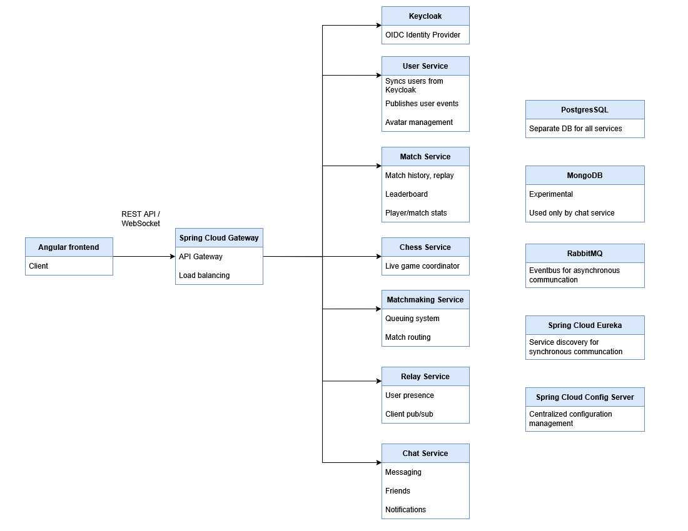
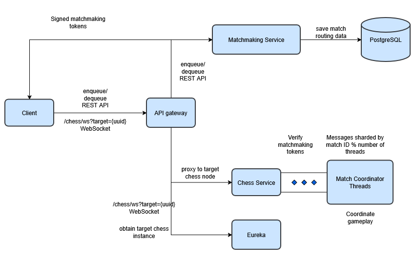

# Chess Platform - Microservices

## Table of Contents

1. [Features](#features)
2. [High-level architecture](#high-level-architecture)
    1. [The Event Framework](#the-event-framework)
    2. [Keycloak / User Service](#keycloak--user-service)
    3. [Relay Service](#relay-service)
    4. [Chat Service](#chat-service)
    5. [Match Service](#match-service)
3. [Deep dive on matchmaking / live game ](#deep-dive-on-matchmaking--live-game)  

## Features

- User authentication. The site is usable by registered users only.
- The game of chess with all the rules implemented. Draws are simplified compared to the standard rules.
- Automated public matchmaking system for both competitive (ranked) and non-competitive (unranked) games, based on the [Elo rating system](https://en.wikipedia.org/wiki/Elo_rating_system) to match players and evaluate their skill levels.
- Private matchmaking: friends can invite each other to play together.
- Reconnect: if a player has been disconnected or closed the app, they can reconnect to their ongoing game.
- Match replays for analyzing past gameplay.
- Leaderboard, based on the ranked, public MMR/Elo rating of the players (MMR - matchmaking rating). (The unranked MMR is hidden from the players. It is only used by the system to match players for unranked games.)
- Friend system: users can send, accept and reject friend requests or can remove (but not block) friends.
- Notifications.
- Real-time chat:
    - Friends can message each other.
    - Emoji and user status support (online, offline, away, in-game, looking for match).
    - Typing indicators.
    - Chat history.
    - Highlighting of unread messages.
- User profiles:
    - Player statistics: the time a player registered, what was the last time they were online, ranked MMR, percentile, longest winning/losing streak.
    - Game statistics: how many games a player has played of each type in total (ranked, unranked, both added together), how many of them have been wins, losses or draws. Win ratio.
    - Filterable friend list and match history.
    - Profiles can be looked up by display names.

- User settings:
    - Display name, avatar, password and e-mail address can be changed.
    - Privacy settings: a user can control who can see parts, or all of their profile: only themselves, only friends, or everybody.
    - Accounts can be deleted permanently.

## High-level architecture

The backend is made up of 7 services: Keycloak, user, match, chess, matchmaking, relay and chat services. Each service is backed by their own, separate PostgreSQL database. The services, with a few exceptions, are entirely event-driven, with RabbitMQ facilitating communication between them. The Angular frontend can talk to the services via the API gateway, implemented with Spring Cloud Gateway. Spring Cloud Eureka is used for service discovery, and Spring Cloud Config Server for centralized configuration management. Since I wanted to learn about NoSQL databases including their pros and cons and when to use them instead of a traditional RDBMS, I also experimented with MongoDB. The services are orchestrated with Docker Compose.

You might be thinking that this project is overengineered and overcomplicated: who would go about implementing a multiplayer online chess site as a multi-service system without knowing how each part of the application should be scaled, or whether it needed scaling at all? You would be absolutely right if you were thinking that. The whole application could have been implemented as a well-modularized monolith without the additional complexities of inter-service communication, eventual consistency, and system failure handling. However, the complexity is intentional as my goal in developing this particular application was to teach myself microservices and distributed systems concepts, which would have been impossible had I not introduced these complexities.

### The Event Framework

The event system is implemented with the transactional outbox pattern: events, in addition to any related data, are committed to the database in one transaction, and, if the commit was successful, immediately published to RabbitMQ. Events whose purpose is not solely to provide live updates to the client must be acknowledged. The system is idempotent, eventually consistent and guarantees at least once delivery: if an acknowledgement does not arrive in a specified amount of time, the event is republished. Also, if an event has already been processed by the receiving party, but somehow the acknowledgement got lost, a new acknowledgement will be sent in response to the next delivery, but without reprocessing the event. Event tracking is entirely hand-rolled, it does not use RabbitMQ-specific features, such as publisher confirms and message acknowledgements. This makes the implementation message-broker-agnostic.

### Keycloak / User Service

Keycloak is the identity provider, authentication mechanism behind the application. Keycloak implements OpenID Connect (OAuth 2.0) as its authentication protocol. Users directly register with Keycloak. Once a user has succesfully registered, an event containing the registered user's data is immediately published by Keycloak to a RabbitMQ exchange, a mechanism implemented with a custom Keycloak SPI. The event then is picked up by the user service to save the user in its own database, and to republish it to all interested services. Should the event get lost (e.g.: the Keycloak instance registering the user crashes between commiting the user to the database and publishing the event, the user service or RabbitMQ becomes unavailable), the user service periodically polls Keycloak for unsynced users. The event system framework above could have been implemented as another Keycloak SPI to eliminate the polling, but according to the documentation, adding custom JPA entites to Keycloak is possible but unsupported, meaning there is no guarantee that it won't be removed or changed in the future without warning.

In addition, the user service is a CRUD service, supporting avatar management (upload, delete), and updating a user (such as updating the display name of a user). Nothing other than the username and e-mail is stored by Keycloak.

**Published events by the user service**:
- **User Created**: published when the registered user has been commited to the database. Interested services: matchmaking, chat, relay, match
- **User Updated**: published when the display name or avatar of a user is updated. Interested services: matchmaking, chat, relay, match
- **User Deleted**: published when a user has been deleted. Interested services: matchmaking, chat, relay, match.

**Access token handling:**
Keycloak issuess access tokens as JWTs. The access/refresh tokens are stored in memory on the client, not in local storage to mitigate XSS attacks. The authentication workflow is as follows:

After the page has loaded, the client immediately redirects the user to Keycloak. Since a public client such as our Angular frontend can't store the client secret securely, the OAuth 2.0 authorization flow used is the Authorization Code grant with the PKCE extension. If there is an active session with Keycloak, Keycloak immediately redirects the browser to the application's callback URL with the authorization code associated with that active session. The application then exchanges the authorization code for an access/refresh token, which are in turn stored in memory, and the user is allowed to use the application. If there is no active session, Keycloak asks the user for their credentials. If they are correct, the application obtains an access/refresh token as before, if not, the user is denied access. In subsequent API calls, the application refreshes the access token using the refresh token around the time it expires without asking the user.

Storing the access/refresh tokens in local storage would eliminate the need to always redirect to Keycloak when the page is loaded, making the load time slightly faster and the user experience slightly better, but it would also expose the application to XSS attacks, where an attacker could steal the access token.

### Relay Service

A websocket service that pushes live updates to clients. Instead of all services with live updates maintaining a websocket connection with the client, they send their updates as "broadcast events" via RabbitMQ to the relay service, which in turn forwards the events to the clients, centralizing push notifications in one service. All nodes of the relay service receive the broadcast events since it is not known ahead of time which node a recipient is connected to.

After a websocket connection has been established, the client authenticates by sending a message of type AUTHENTICATE with the Keycloak access token as the payload. (If the client does not authenticate in a specified amount of time, the websocket connection is closed.) The service verifies the access token, and if the verification is successful, the connection remains open and the client can then start receiving updates. If the user has provided an invalid access token, the connection is closed immediately.

Besides, the service manages user presence (online, offline, away).

How does the relay service know which clients a broadcast event should be forwarded to if it does not have the list of recipients? Some events do contain recipient information, but some do not. For events that do not contain a recipient list, the service acquires it by calling a chat service endpoint that returns the contacts of the sender.

### Chat Service
A CRUD service that provides a REST API for channel handling, instant messaging, friend requests, notifications, and related queries. It also provides privacy settings for querying friend data.

Published events:

- **ChannelTypingEvent (client/broadcast event)**: sent by a channel member to other channel members when they have started typing. Interested services: relay.
- **NotificationEvent (client/broadcast event)**: sent when a user has created/accepted a friend request. Interested services: relay.
- **UnfriendEvent (client/broadcast event)**: sent when a user has unfriended a friend. Interested services: relay.
- **MessageCreatedEvent (client/broadcast event)**: sent by a channel member to other channel members when they have posted a message. Interested services: relay.
- **MessageEditedEvent (client/broadcast event)**: sent by a channel member to other channel members when they have edited a message. Interested services: relay.
- **MessageDeletedEvent (client/broadcast event)**: sent by a channel member to ther channel members when they have deleted a message. Interested Services: relay.

### Match Service
A query service that provides a REST API for querying past match data, replays, game/player statistics and privacy settings. All this data is obtained by the chess service sending an event when a match has ended. All match data is owned by the match service.

## Deep dive on matchmaking / live game

High-level architecture  

The client enters a matchmaking queue, calling the corresponding REST endpoint on the matchmaking service. There is a separate matchmaking queue for ranked and unranked games.

When the player is placed into the queue, the system assigns an MMR range to the player, and tries to insert them into an in-memory binary tree sorted by MMR range. If there is a player with an overlapping MMR range, the system removes both players from the queue and queries Eureka for the UUID of an available chess service node in a round robin fashion. It then creates a so-called matchmaking token (or ticket) containing the data the chess service needs to create a match: a random 64-bit match ID generated by the matchmaking service, the player ID, the type of the match (ranked, unranked, private), the player's MMR (if applicable), and the UUID of the target chess service instance. Before the tokens are handed off to the players, they are cryptographically signed so that clients can't forge them. To make reconnecting to a game possible, the matchmaking service saves the match routing data to the database. If there aren't any players with an overlapping MMR range, the player is reinserted into the tree and sits there waiting for another player. If their time in the queue is up, they are removed from the queue, their MMR range is expanded, and then they are inserted back into the queue. This whole process is repeated in a loop until another compatible player is found, the player decides to leave the queue or the player disconnects.

Private games circumvent the matchmaking queues. They work by one player inviting another. Matchmaking tokens are generated and match routing data are saved for private games as well.

The client connects to a game by presenting their matchmaking token to the pre-selected chess service node. The client establishes a websocket connection with the API gateway, calling "/chess/ws?target={node-uuid}". The API gateway obtains the IP address of the target node by parsing out the node UUID from the target query parameter, and querying Eureka. If there is a node with the given UUID, the API gateway opens a websocket connection downstream with the chess service node, proxying the original connection, otherwise it terminates its connection with client. The client then has to go through the same authentication workflow as it does with the relay service. If authentication was successful, the client sends their matchmaking token in a JOIN_MATCH message to the chess service to be verified. The service verifies the token signature using the public key of the matchmaking service, then checks whether the player ID in the token matches the ID of the authenticated user, and whether the target node UUID matches its own. (Players reconnect with a JOIN_MATCH message as well, but token verification is skipped if a player already has a game in progress). If verification fails, the connection is closed, else the token is handed off to one of many coordinator threads, based on the match ID (the target thread is determined by taking the modulus of the match ID and the number of threads), confining a match to a single thread. Each subsequent match-related message is sharded by the match ID too, and thus handled by a single thread. If there is no match with the given ID, the match is created, the player is added to the match, and a connection timeout is started. If the other player does not connect before the timer runs out, the match is cleaned up, and the first player is disconnected. If both players are connected, a chessboard is instantiated, a flag-fall timer is started (or a promotion timer if promotion is in progress), then the coordinator keeps accepting messages in an event-loop until the game is over. Then a MatchEndedEvent is fired with all the match data, and the match is cleaned up, and the players are disconnected.
